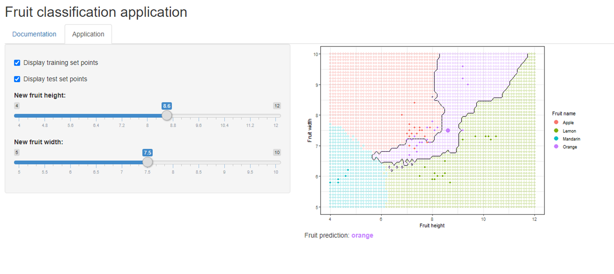

Fruit classification application
========================================================
author: Gvaurs
date: 28 December 2020
autosize: true


Objective
========================================================

A fruit classification application has been developed. The application targets 4 types of fruits: 
- Apple
- Lemon
- Mandarin
- Orange

The goal is to classify the fruits based on two simple characteristics:
- Height
- Width

Model development (1/2)
========================================================

- The fruit dataset is obtained [here](https://www.kaggle.com/mjamilmoughal/fruits-with-colors-dataset)
- The data is splitted into training dataset (70%) and test dataset (30%)

```r
fruits <- read.csv(file='https://raw.githubusercontent.com/susanli2016/Machine-Learning-with-Python/master/fruit_data_with_colors.txt', sep='\t')
fruits_in_training <- createDataPartition(fruits$fruit_label, p=0.7, list=FALSE)
fruits_training <- fruits[fruits_in_training,]
fruits_testing <- fruits[-fruits_in_training,]
```

Model development (2/2)
========================================================

- The classification model uses the [K-nearest-neighbors algorithm](https://en.wikipedia.org/wiki/K-nearest_neighbors_algorithm).
- The optimal model uses 5 nearest neighbors, and the accuracy on the testing set is 75%.

```
          Reference
Prediction apple lemon mandarin orange
  apple        3     0        0      2
  lemon        0     4        0      0
  mandarin     0     0        0      0
  orange       2     0        0      5
```

```
Accuracy 
    0.75 
```

Application screenshot
========================================================


